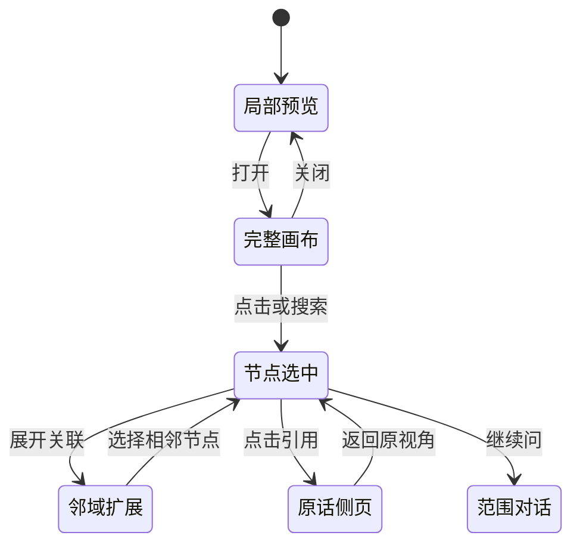

# VoiceLog / 声迹 · 交互与状态规格 v1.1

## 1. 全局约定

逻辑设计基准390×844，浏览器宽度随设备适配，检验320／360／390／430及桌面视口。主导航固定总览／场景／对话／我的。快速记录独立于场景选择；设备身份和来源引用使用同一套组件。

总览的“时间线／人物交汇”消费同一份记录。首页不输出长篇产品解释；必要的模拟状态、数据缺失、候选解读和授权信息仍然清楚保留。

## 2. 页面与动作清单

| 页面 | 主入口 | 关键动作 | 返回状态 |
|---|---|---|---|
| 我的天／多天 | 总览 | 日期、过滤、折叠、搜索、复盘、记录 | 保存展开块与浏览位置 |
| 时段回看 | 场景块底部 | 内部事情、局部关系、该时段对话 | 回到原场景块 |
| 人物交汇 | 总览切换 | 滚动、滑杆、区间、全部人物、固定排列 | 保留焦点时间与人物选择 |
| 人物详情 | 头像或交汇 | 原话、候选解释、否定、回复、图谱、对话 | 回到该时间段 |
| 场景列表 | 第二导航 | 类型筛选、项目或场景详情 | 保留类型选择 |
| 场景详情 | 场景列表 | 总览／记录／分析／关系 | 共用稳定页签 |
| 记录详情 | 事情条目 | 转写／声音／本次结果、原声、笔记、照片、删除 | 回到来源入口 |
| 关系画布 | 局部预览 | 拖动、缩放、搜索、过滤、展开、详情、表／节点列表 | 引用关闭后恢复节点和视角 |
| 统一对话 | 第三导航或上下文 | 范围、输入、示例语音、引用、关系 | 消息按范围保留 |
| 复盘 | 总览 | 当前日／多天变化、人物、心情、安排 | 时间范围保持 |
| 日历 | 首页日历图标 | 日期筛选、草稿、确认、规则、冲突、导出和取消 | 显示实际本机状态 |
| 我的 | 第四导航 | 设备、偏好、心情、关系、日历、隐私 | 不复制另一套消费逻辑 |
| 设备 | 设备条／我的 | 示例连接、控制、断连恢复 | 状态同源 |
| 夜间 | 场景列表／晚间卡 | 未来预览、醒后本人笔记 | 无假分析指标 |

## 3. 首页外层与内层

外层场景块顺序依据日期和开始时间。相同工作类型被午饭中断时分成两块，不跨空白强制合并。默认只展开一块；有多个事件时内部仍显示各自时间，个人独立制作与局部交流可以重叠。

时间标签固定不伸缩；标题容器 `min-width:0`，长内容换行或在明确的小区间内截断。不能通过变长截图隐藏布局问题。展开保持所点卡片在原位置；内部内容淡入和轻位移约200ms，其他主要操作不增加等待动画。

## 4. 人物轨道的状态

- 当前活跃、20分钟内、60分钟内、其他分级排序；并列保持先前顺序。
- 可搜索当天所有人并固定一个人；减少动态效果时不自动换位。
- 拖动／指针按下／详情打开时暂停重排；视觉过渡约260ms，节流约270ms。
- 短于38px的区间只显示头像；中短区间用短标题；原时长保留在点击详情和可访问名称中。
- 不因重排修改原始区间，不将录音沉默视为离开，也不将多人重叠时段重复算入同一人的统计。

## 5. 关系图状态与操作

节点与边有独立选中行为。hover仅在细指针设备启用；未选时恢复普通状态，已选时恢复其邻域状态。搜索结果可以打开当前过滤之外的节点。原话开关控制明细密度。键盘 `+/-/0` 和方向键提供缩放、适应画布与平移，Esc关闭弹层；Tab保持在当前模态范围。

完整图采用全屏自适应容器。手机检查器位于底部，最多占约35dvh；桌面使用右侧检查器。图坐标是可移动的画布，边缘节点可以在视口之外，普通文本、按钮及检查器不得溢出页面。

## 6. 原话、修订与媒体

蓝色引用 → 标题、时段、原引用版本和定位 → 本机音频可播放 → 原记录句子高亮。没有绑定文件不出现假波形回放；本机文件时長不足则提示。修订保留旧版本，恢复历史也写新版本，影响相关摘要与未执行安排的状态。

笔记、梦境回忆、照片由本人补充，和转写明确分开。删除当前记录后引用和图谱同步撤回可见性。演示没有服务器访问控制，生产版必须再次校验账号、授权、来源和时间范围。

## 7. 交流理解与心情

界面只呈现当次候选解释、支持程度、原话与可编辑回复。选择某项解释会取消该项先前的否定；否定会取消其选择。回复可复制或保留为草稿，不自动发送。Jev为后续判别接口，演示数据不冒充实时推理。

心情候选允许删除和本人改写；本人感受保留为自述。不得在无数据处补出连续心情曲线。

## 8. 日历、录音和降级

| 输入或动作 | 状态变化 |
|---|---|
| 明确本人日程 | 草稿 → 预览 → 本机已存 |
| 缺时间／冲突 | 待补全或核对，不执行 |
| 有限自动授权 | 到期、对象、来源、冲突全部满足后运行 |
| 日程内容改动 | 新版本待确认；不沿用旧确认 |
| 取消 | 本机取消，不宣称已改外部日历 |
| ICS导出 | 文件下载，不等于系统日历已导入 |
| 演示录音 | 计时 → 暂停／标记 → 保存本人笔记，不生成音轨 |
| 断连 | 状态待核实，不能启动新的演示录音 |
| 示例语音 | 倾听 → 暂停／回复 → 可打断回文字；不启用麦克风 |
| 无依据问答 | 无来源回答或提示当前范围不足，不造引用 |

## 9. 验收与消融

验收针对当前交付HTML、数据和脚本：分块不漏事件；时间顺序、日期和区间并集正确；人物轨道换位保持身份；图谱点击与来源返回成立；文本／表单在320px仍可操作；修改、删除与日历规则保持一致；触屏和减少动态效果有替代入口。

平铺／分块、动态／固定人物、图形／列表是同数据对照。自动检查不等于真实用户实验；查看日志中的加载环境、覆盖视口和限制，不将“脚本通过”解释为所有手机、所有文本和真实模型均已通过。
