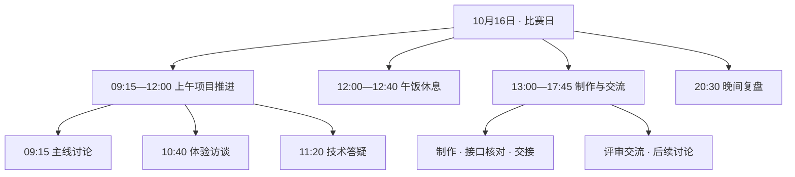
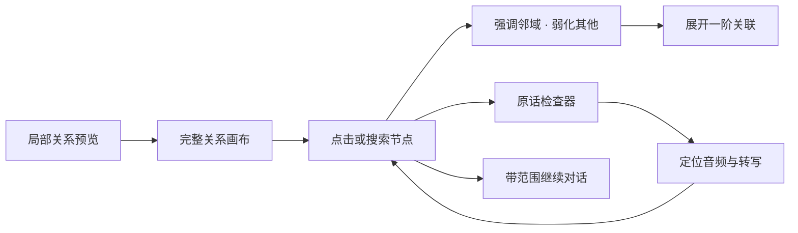
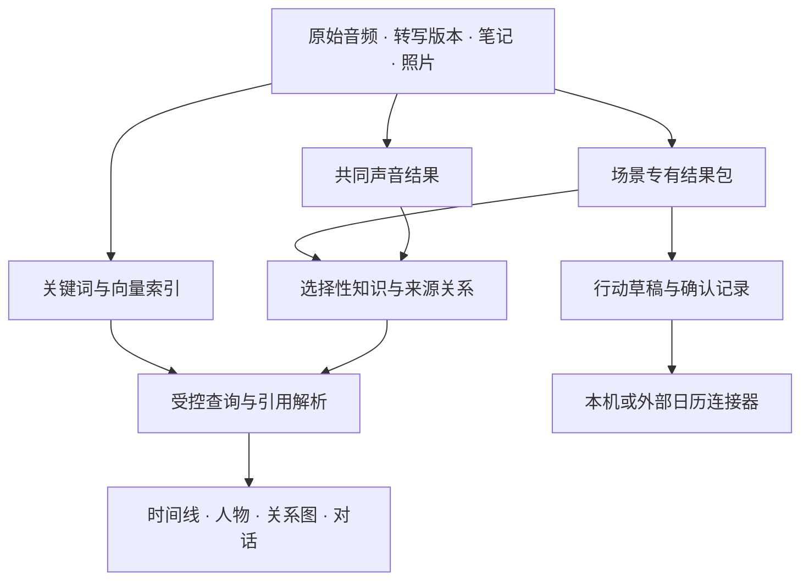
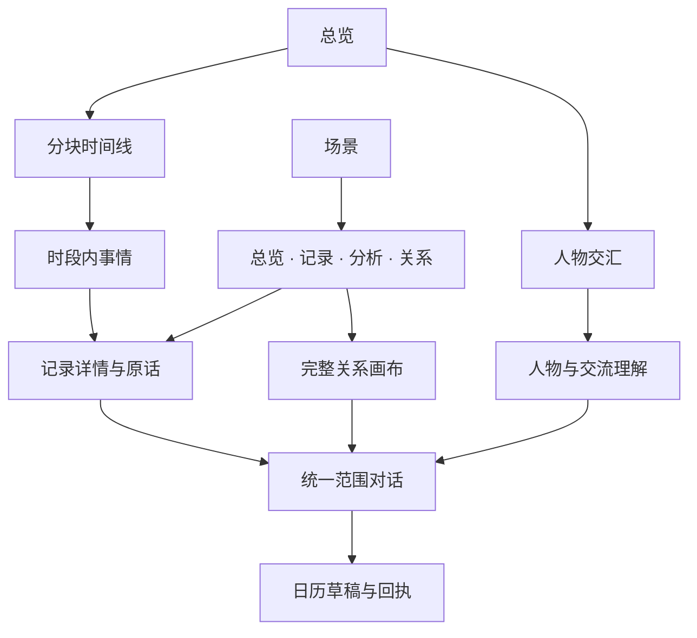
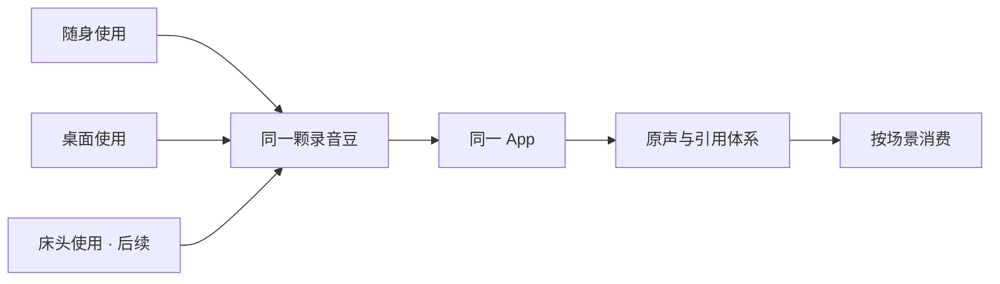
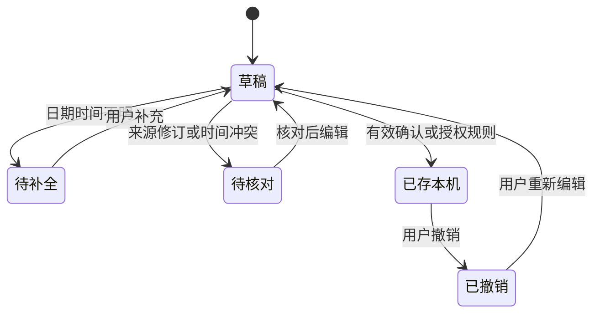
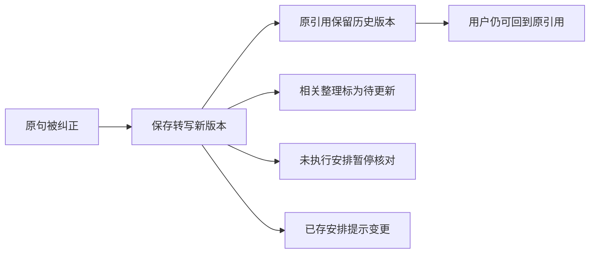

# VoiceLog / 声迹
## 产品与交互白皮书 v1.1

**一日生活记录，按场景展开，沿人物与原话接着使用。**

| 基线 | 当前决定 |
|---|---|
| 主要使用者 | 经常讨论、学习和制作的个人；首个样例是开发者的比赛日 |
| 主要时间尺度 | 一天与多天；时间顺序始终保留 |
| 核心呈现 | 场景分块时间线、人物交汇、可探索的关系图 |
| 硬件 | Anker soundcore Work 3200；使用用户提供的实际产品图 |
| 交付形态 | 离线单 HTML、可编辑资料、测试与浏览器截图 |
| 当前能力 | 真实前端交互与本机数据操作；转写、识别和理解使用预置样例 |
| 后续能力 | SDK、ASR、声纹、Jev／其他判别模型、真实日历连接；夜间仅预览 |

**这次重构。** 首页将连续工作时段收成外层场景块，会议、访谈和答疑保留内部事件线；人物轨道按浏览时间平滑换位；关系图采用可拖动、缩放、选择、展开和回到原话的真实图组件。页面不再以讲解性长文解释自身。

数据日期为 **2026-10-16、10-17的虚构样例**，不代表主办方实际日程、真实评审意见或获奖结果。产品规格与已实现行为分开记录。更早的医嘱／老人双场景主线已退出本版。

<!-- PAGE -->
## 01 / 一天怎样组织

一天按真实顺序浏览。外层“场景时段”是连续经历的容器，内层“事情”保留发生时间、参加者、原话和场景专有结果。主题、场景类型和发生时段是不同维度。

| 对象 | 用途 | 不承担的职责 |
|---|---|---|
| 日期 | 总览的浏览边界 | 不等同于录音持续时长 |
| 场景时段 block | 连续工作、休息、复盘的一段；可折叠 | 不将上午和下午两个工作时段移动到一起 |
| 事情 episode | 一次讨论、采访或口述；可有重叠 | 不需要每件事都成为一个新的场景包 |
| 场景类型 scene | 协作、访谈、答疑、制作等结果模板 | 不改变全局时间顺序 |
| 项目 topic | 比赛项目跨日接续的主题 | 不把生活和休息强制解释为工作成果 |

**交互。** 默认展开上午的工作块，其余收起。打开另一块时收回原块；展开内部事情，再进入同一套记录详情。未录时段、本人补记、夜间预览保留各自状态。日期切换不会把昨天的变化写成今天。

<!-- PAGE -->
## 02 / 人物交汇：另一种读同一天的方法

时间向下，用户在最左，人物拥有头像、名称与独立轨道。交流区间的高度来自时间；短区间只放能容纳的头像和短题，详情通过点击展开，不撑大区间来伪造时长。

| 规则 | 本版实现 |
|---|---|
| 当前活跃优先 | 当前发生的交流优先，其次临近时段；同级保持先前顺序 |
| 身份连续 | 同一个人物 ID 的头像、名称和全部区间整体移动 |
| 限制抖动 | 重排节流约270ms；拖动与详情交互中保持稳定 |
| 人物很多 | 同屏按宽度显示2—4条联系轨道；其他人物可以搜索并固定到左侧 |
| 动画 | transform 约260ms；中途可继续操作，不运行不可中断的长动画 |
| 替代操作 | 时间滑杆、人物列表、固定排列、减少动态效果 |
| 统计 | 仅已确认且已记录的交流区间，先求并集后汇总 |

示例中小林部分区间互相重叠。直接累加为117分钟，求并集为110分钟。这是样例数据上的确定性计算，不代表实际陪伴时间、亲密度或对人的关注程度。匿名交流者不自动获得跨日身份和已确认时长。

原型没有运行声纹。真实版本需要区分说话人分离、参与者确认和同意后的身份匹配；声纹不能自行确定职业或社会角色。

<!-- PAGE -->
## 03 / 交流理解与心情历程

交流理解围绕**这句话和这件事**给出几个可核对的解释，并提供可编辑的回复草稿。它可用于同伴交接、评审反馈、课堂答疑等场景，不独立复制一套社交资料库。

**原型例子。** 评审交流者明确认可时间线，并要求人物分析能打开原话。因此“希望看到依据”有文字支持；“已经决定给作品获奖”没有依据。界面显示候选及原因，用户可以选择、否定、编辑回复并复制；不会自动发送。

**Jev 的位置。** TypeSafe 官方文档描述的 Jev 可接收状态与类型化问题，返回 Choice、Score 或 Noul。未来可作为候选判别接口之一；中文模型生成候选和整理上下文，判别层再比较候选。本版只使用预置候选与理由，没有加载模型或调用其 API，不报告准确率、置信概率或实时吞吐。

**心情历程。** 本人填写的感受与交流中的待核对线索分开。候选可删除，也可由本人重新表述。数值不作为心理测量，不从声音推断诊断、人格、隐藏意图或“别人到底有多喜欢我”。缺少材料时不补齐一条完美曲线。

**共同声音分析。** 每件事情均可查看环境与收声结果：重叠人声、背景声音、有效片段等。原型明确标为示例声音事件，不把噪声解释为个人不认真或负面情绪。

<!-- PAGE -->
## 04 / 关系图：能探索，也能回到出处

场景里先显示少量邻域。打开完整图，进入独立的可交互画布：桌面右侧检查器，手机底部检查器。图、列表和对话消费同一份经过范围限制的数据。

| 行为 | 规定 |
|---|---|
| 平移、缩放、拖动 | 背景拖动平移，节点拖动改变位置；滚轮、触控与按钮控制视角 |
| 聚焦 | 默认关注一个节点；选中后突出实际邻接关系，允许适应全图 |
| 展开 | 增加节点的原话或相邻内容；保持选中身份，布局过渡可中断 |
| 查找和过滤 | 搜索人物、概念或记录；人物／要点过滤与原话开关 |
| 来源 | 蓝色小引用进入原话；关闭后回到原节点和视角 |
| 可访问替代 | 节点列表、关系表、键盘缩放和方向移动，不要求精确点小圆点 |
| 删除／修订 | 已删除记录退出可见图；有修订的来源显示版本状态 |

图采用 Cytoscape.js 的真实画布和布局能力，MIT 许可随包附上。交互借鉴 Obsidian 的全局／局部图、hover 邻域与导航语义；未使用 Obsidian 专有实现。

**连线语义保持准确。** 包含、原话来源、参加、整理自、支持、细化、关联和行动草稿分开。有出处不等于因果成立；同一时间发生也不写成因果。未验证解释只可标为假设。

<!-- PAGE -->
## 05 / 数据模型与范围

原始资料、场景结果、检索、关系与行动有不同职责。场景分块和人物排序是视图，不迁移、复制或改写原始录音。

| 数据 | 当前原型 | 正式实现建议 |
|---|---|---|
| 原始媒体 | 本人临时选择的本机音频；引用样例不附现场原声 | 私有对象存储、哈希和格式元数据 |
| 转写与笔记 | 有时间戳的示例句段、修订历史、本人笔记 | 版本化正文与句段，来源稳定 |
| 分块 | `blocks`引用episode IDs，跨日与空白清楚 | 根据明确上下文提出边界，允许用户纠正 |
| 人物 | 参与者、交流区间、身份确认状态 | 授权后的识别与确认，匿名和登记分开 |
| 结果包 | 不同事件的items、itemRefs、sound与候选解释 | 固定信封＋每包Schema，长数组外置 |
| 图谱 | 可见节点／类型化边及引用 | 按资料和确认信息投影，可重建 |
| 行动 | 草稿、版本、规则、演示回执 | 独立事务状态、幂等和实际连接器回执 |

查询范围包含日期、场景、时段块、单条记录、人物和项目。每一个引用先检查来源可见性，再检查范围与时间区间。统计使用确定性工具；索引帮助找资料，图谱帮助找关联，不用语言模型估算时长。

<!-- PAGE -->
## 06 / 统一页面与定制边界

**一级导航：总览 / 场景 / 对话 / 我的。** 首页设备条和其他页面同位置的快捷按钮进入录音控制。日历位于总览的明显入口与“我的”中，不成为第五套业务导航。

| 位置 | 固定外框 | 内容差异 |
|---|---|---|
| 时段块 | 时间、名称、条目数、折叠动作 | 会议、访谈、答疑或生活事件的内部时间线 |
| 记录详情 | 记录／声音／本次结果、播放器、来源、笔记、照片 | 协作决定、访谈诉求、学习重点等 |
| 场景分析 | 范围、模块标题、原话引用 | 该类型事项的聚合与专有消费 |
| 对话 | 范围胶囊、消息、小引用、输入 | 默认资料和可用工具 |
| 关系 | 相同画布和检查器 | 初始节点与可见子图 |

首屏不塞全部图谱，不出现解释设计理念的大段文字。输入、表单和可变数字使用可收缩容器；小区间标题截断时保留头像、可访问名称和详情入口。主要操作有明确可点区域，手势提供快捷方式而非唯一入口。

<!-- PAGE -->
## 07 / 录音豆与真实媒体

实际产品图用于设备条、设备页与桌面侧栏，保持原结构与比例。首页第一屏可以直接开始记录，不需要先选三层场景。记录中可以暂停、标记、结束和补记。

**本版真实与模拟的分界：** 计时、标记、状态切换及笔记保存实际运行；设备连接与同步是演示状态，没有读取设备、开启浏览器麦克风或生成音轨。未绑定音频时显示“原声未绑定”。选入本机文件后，浏览器真实解码播放并按引用时间跳转；文件不上传，文件长度不够时明确提示。

| 异常 | 消费端反馈 |
|---|---|
| 连接中断 | 设备状态待核实；不假定设备本体一定停止 |
| 原声缺失 | 转写示例可看，播放器不伪造回放 |
| 引用区间超出文件 | 不跳到错误片段，提示核对文件 |
| 原话更正 | 新版本与原版本共存，相关整理待更新 |
| 导入照片 | 本人附件，与模型结果分开；可移除 |

睡眠只保留夜间入口、未来指标占位和醒后笔记。不显示未实际计算的睡眠时长、翻身次数、呼吸诊断或分期。

<!-- PAGE -->
## 08 / 日历：从记录进入已有安排

日历读取是未来场景识别线索；日历写入是行动出口。原型将完整确认逻辑落在本机演示日历，并支持真实生成 `.ics` 文件，由用户决定是否导入系统日历。

有限规则由本人主动开启：仅本人、时间明确、来源有效、无冲突、有到期日的新安排。它不邀请他人，不重排已创建事件，不把玩笑、愿望或模糊时间写成事实。内容改变后旧确认失效。

**样例里的两种“颁奖”。** “明天下午三点参加颁奖环节”有活动说明原话，可以成为明确安排；“精妙绝伦，明天上台领奖”是一条愿望便签。节目效果不改变资料真实性。

<!-- PAGE -->
## 09 / 修订、隐私与长期使用

| 控制 | 本版规定 |
|---|---|
| 记录授权 | 多人交流需告知与同意；私人时段可以只保留本人时间标签 |
| 角色与身份 | 分离说话人、确认角色、经同意登记；不把身份推断藏在统计里 |
| 心情与意图 | 原话支持、候选解释、本人自述明确区分；可以拒绝与修改 |
| 资料范围 | 单条记录对话不自动检索整个生活史；图谱按相同范围生成 |
| 修订 | 恢复旧文字也形成新版本，不擦除历史 |
| 删除 | 本机记录撤回后，引用解析与图谱都不再提供它 |
| 外部影响 | 删除资料不静默删除真实日历；当前没有外部服务连接 |
| 数据导出 | 本机JSON与ICS可下载；导入音频URL只在当前会话有效 |

真实部署还需实现服务器验权、存储保留政策、账户及共享授权、审计、模型输入隔离和加密。离线原型的前端过滤不等同于生产权限保障。日常分析授权不等同于训练、公开展示或第三方共享授权。

<!-- PAGE -->
## 10 / 设计消融与检验

本轮通过同一批样例比较布局与交互机制，保留可切换的“分块／平铺”对照。检验分为确定性数据测试、浏览器交互和视觉复核，未进行真实用户效率或模型准确率实验。

| 消融或修复 | 检验目标 | 取舍 |
|---|---|---|
| 平铺每件事 → 连续场景块 | 内容不丢、日期和顺序不改，首层更少入口 | 保留分块与内部时间线 |
| 固定人物 → 时间相关换位 | 头像与区间同步移动，同级不抖动 | 默认自动靠近，可固定、可减少动态 |
| 关系图只展示 → 可操作画布 | 点击、搜索、展开、原话返回可贯通 | 使用真实图组件 |
| 每页长解释 → 操作与状态文案 | 内容仍可理解，释放首屏空间 | 说明集中在帮助、资料和规格 |
| 无原声仍显示播放 → 缺失状态 | 不制造假音轨或假定位 | 允许导入真实本机文件 |
| 单次解读变成人格 → 当次候选 | 用户可核对、否定与修正 | 不做人物定性分数 |
| 完整日程产品 → 小型行动桥 | 有明确现实出口，范围不过度扩大 | 本机规则＋导出，真实连接后续 |

检验结果与原始日志见 `reports/TEST_REPORT.md`、`browser_checks.json` 与 `data_checks.json`。统计数字由检查脚本生成，本文不复制一套易过时的计数。

**环境边界。** 浏览器策略阻止 file:// 和 localhost 导航；自动测试以同一HTML的内存文档运行。存储使用明确的测试替身，文件来源持久化、Safari和实体手机仍需实际验证。所有真实硬件、ASR、声纹、Jev与外部日历接入状态保持“未连接”。

<!-- PAGE -->
## 11 / 本轮交付与后续

| 层次 | 本轮交付 | 后续接入 |
|---|---|---|
| 产品消费 | 分块一天、多天、人物换位、来源、图谱、交流候选、复盘 | 用真实比赛当天资料替换样例 |
| 媒体 | 本机音频与照片导入、播放、定位、删除 | 官方SDK取回音频和实体标记 |
| 理解 | 预置转写与场景结果，互动规则真实运行 | ASR、说话人分离、中文候选生成与Jev对照 |
| 行动 | 本机日历、确认、有限规则、ICS导出 | 连接器读取、真实回执与增量同步 |
| 扩展 | 同一个壳承载工作／访谈／学习／生活；夜间UI预览 | 夜间声学模块单独建立数据与验证 |

24小时开发优先贯通一段真实记录：设备取回 → 时间对齐转写 → 场景块 → 一次交流理解 → 引用回放 → 一项明确安排。完整白天样例用于保持产品展示连续。预处理、实时运行与模拟部分分别标记，不将一整天虚构成已经实录。

**交付结构。** 单HTML可以单独带走；ZIP包含源码、固定样例、第三方许可、文档、Mermaid与对应SVG、测试脚本、原始结果、实际截图以及讲解稿。代码不依赖远程CDN，不含密钥、模型权重或字体文件。

产品名称、四项导航和一天主线继续冻结。本版不再以陪诊、老人或框架平台作为主要叙事。

<!-- PAGE -->
## 12 / 来源与设计依据

**用户材料。** 2026-09-26团队转写明确选择VoiceLog、一天为核心、白天优先、按场景收起时间线、人物交流通用能力及日历连接。本轮最新反馈进一步要求连续时段外框、动态人物换位、Obsidian式关系探索和消除穿模。当前要求优先于更早的医嘱和睡眠主线。

| 来源 | 本轮使用方式 |
|---|---|
| Emil Kowalski / skills | 操作反馈、动效时长、变换属性、触控与减少动态效果的审查参照 |
| Obsidian Graph view 官方帮助 | 全局／局部图、选中邻域、图形导航与过滤的交互参照 |
| Cytoscape.js 文档及许可证 | 实际使用的离线图组件，3.33.1，MIT许可证 |
| TypeSafe / Jev 官方介绍 | 类型化判别接口的规划依据；没有执行其模型或接受营销效果作为项目结果 |
| 用户提供的UI母版与产品图 | 配色、排版和真实硬件形象；没有新增AI生图 |

- https://github.com/emilkowalski/skills
- https://help.obsidian.md/plugins/graph
- https://js.cytoscape.org/
- https://github.com/cytoscape/cytoscape.js/blob/v3.33.1/LICENSE
- https://typesafe.ai/
- https://docs.typesafe.ai/introduction

外部交互经验和技术文档用于指导实现，不替代本项目可用性和模型验证。所有样例人物、交流内容、时间与安排为演示构造。
